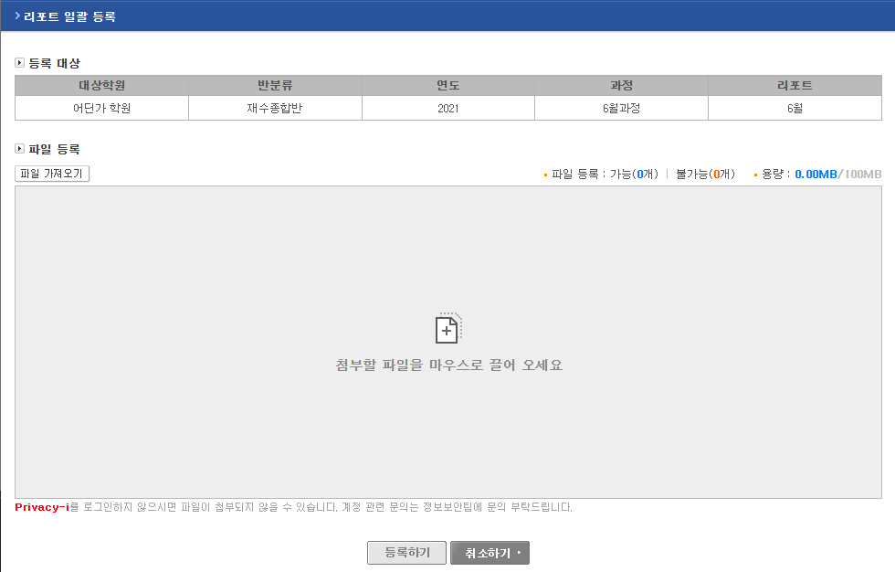
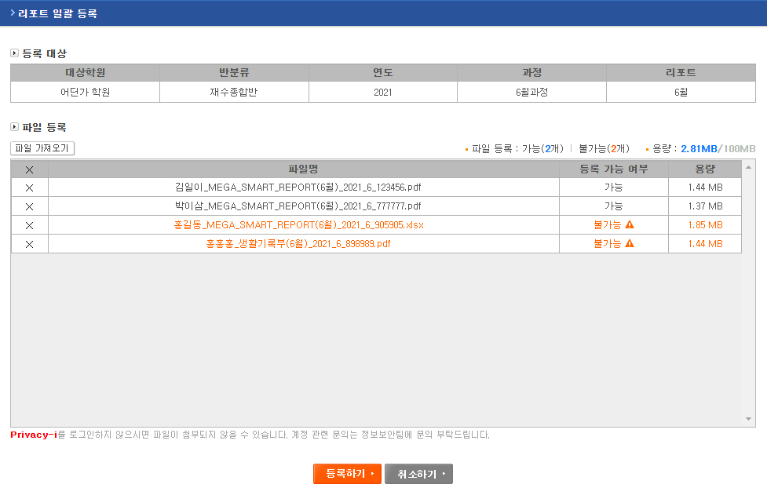

# 다중 파일 drag&amp; drop 업로드
JQuery 사용하지 않음
 
실제 업로드될 파일 목록과 화면에 보여지는 첨부 파일 목록은 따로 관리
 
기존 file버튼을 통해 첨부할 수도 있고 Drag & Drop으로 첨부할 수도 있음
 
파일의 유효성 검사를 위한 정보는 파일이 추가되는 순간에 불러옴

## Loading Modal 창
HTML5의 dialog 태그를 사용하여 간단하게 구현

## 파일 첨부
HTML5 drag&drop API와 ES6 JS로 구현
 
파일 첨부는 HTML과 JS로만 구현했기 때문에 Classic ASP와는 관련 없음
 
IE에서는 이 코드를 사용할 수 없음

## 첨부 파일 전송
비동기 통신 fetch로 파일을 전송
 
await를 사용하여 전송 및 저장이 완료될 때까지 대기

## 파일 저장
Classic ASP와 DEXT.FileUpload로 파일 처리 구현

## MDN 참조 문서
<ul>
	<li>
		<a target="_blank" href="https://developer.mozilla.org/en-US/docs/Web/API/HTML_Drag_and_Drop_API">Drag & Drop</a>
	</li>
	<li>
		<a target="_blank" href="https://developer.mozilla.org/en-US/docs/Web/API/fetch">fetch</a>
	</li>
	<li>
		<a target="_blank" href="https://developer.mozilla.org/ko/docs/Web/JavaScript/Reference/Operators/await">await</a>
	</li>
	<li>
		<a target="_blank" href="https://developer.mozilla.org/ko/docs/Web/HTML/Element/dialog">dialog</a>
	</li>
</ul>

## 추가

